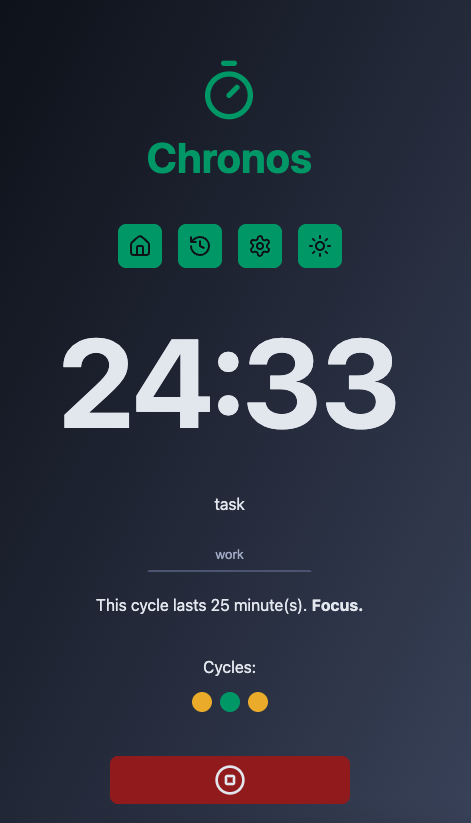

# ⏳ Chronos Pomodoro

Chronos Pomodoro is a minimalist Pomodoro timer application built with
**React**, **TypeScript**, and **Vite**.  
It helps you manage your focus sessions and breaks using the Pomodoro Technique,
with a clean and modern interface.



## ✨ Features

- Start, pause, and reset Pomodoro cycles
- Track your tasks and completed cycles
- Responsive and accessible UI
- Built with modular React components
- Styled with CSS modules and custom themes

## 🧰 Tech Stack

- [React](https://react.dev/)
- [TypeScript](https://www.typescriptlang.org/)
- [Vite](https://vitejs.dev/)
- [Lucide React Icons](https://lucide.dev/)
- [ESLint](https://eslint.org/) for code quality

## 🚀 Getting Started

1. **Install dependencies:**
   ```sh
   npm install
   ```
2. **Run the development server:**

   ```sh
   npm run dev
   ```

3. Open http://localhost:5173 to view the app.

Feel free to customize and expand this project to fit your productivity needs!

---

📅 Done in 2025

> Project by [@luizomf](https://github.com/luizomf)

> Done by [@GHBAlbuquerque](https://github.com/GHBAlbuquerque)
